# FCP Demo Video Storyboard
**Total Duration**: 3:00 (180 seconds)
**Target**: Gemini API Developer Competition Judges
**Goal**: Showcase 15+ Gemini 3 features in action

---

## 🤖 AI-Powered Video Generation

**Meta-Strategy**: "Built with Gemini 3, Demonstrated with Gemini 3" - Use Gemini's video generation capabilities to create the entire demo.

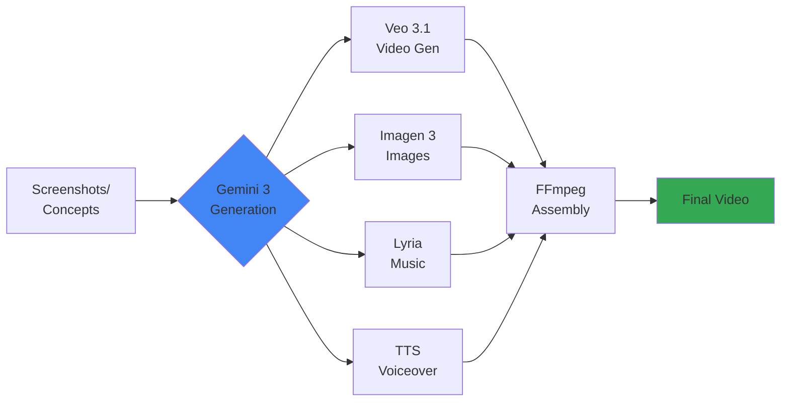

## 📊 Visual Timeline

```mermaid
gantt
    title 3-Minute Video Timeline
    dateFormat ss
    axisFormat %S

    section Act 1: Hook
    Opening Title           :a1, 00, 5s
    Problem Statement       :a2, after a1, 10s
    Feature Montage         :a3, after a2, 10s
    Transition              :a4, after a3, 5s

    section Act 2: Demo
    Image Analysis          :b1, after a4, 30s
    Function Calling        :b2, after b1, 30s
    Google Grounding        :b3, after b2, 30s
    Gemini Live            :b4, after b3, 30s

    section Act 3: Impact
    Dashboard Overview      :c1, after b4, 10s
    Feature List           :c2, after c1, 8s
    Architecture           :c3, after c2, 5s
    Production Quality     :c4, after c3, 4s
    Call to Action         :c5, after c4, 3s
```

## 🎬 Narrative Flow

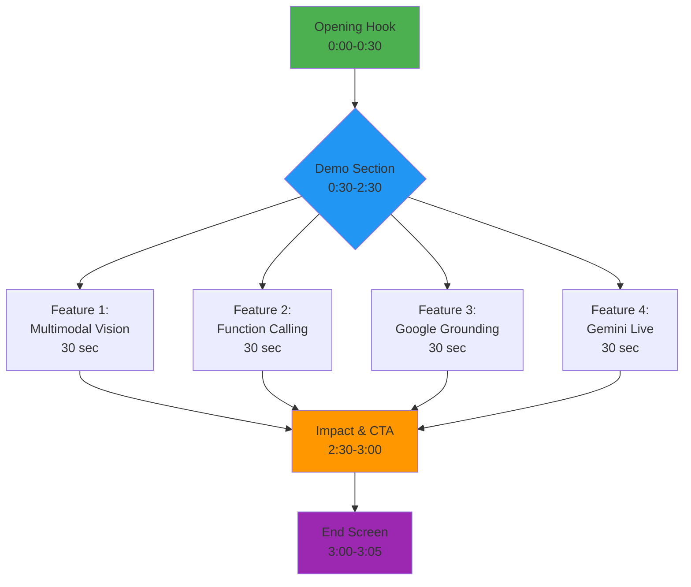

## 📋 Shot Sequence Map

```mermaid
graph LR
    subgraph "Act 1: Hook (30s)"
        S1[Shot 1<br/>Logo<br/>5s]
        S2[Shot 2<br/>Problem<br/>10s]
        S3[Shot 3<br/>Montage<br/>10s]
        S4[Shot 4<br/>Transition<br/>5s]
        S1 --> S2 --> S3 --> S4
    end

    subgraph "Act 2: Demo (120s)"
        S5[Shot 5-8<br/>Image Analysis<br/>30s]
        S9[Shot 9-12<br/>Function Call<br/>30s]
        S13[Shot 13-16<br/>Grounding<br/>30s]
        S17[Shot 17-19<br/>Live API<br/>30s]
        S5 --> S9 --> S13 --> S17
    end

    subgraph "Act 3: Impact (30s)"
        S20[Shot 20<br/>Dashboard<br/>10s]
        S21[Shot 21<br/>Features<br/>8s]
        S22[Shot 22<br/>Architecture<br/>5s]
        S23[Shot 23<br/>Quality<br/>4s]
        S24[Shot 24<br/>CTA<br/>3s]
        S20 --> S21 --> S22 --> S23 --> S24
    end

    S4 --> S5
    S17 --> S20

    style S5 fill:#E1BEE7
    style S9 fill:#E1BEE7
    style S13 fill:#E1BEE7
    style S17 fill:#E1BEE7
```

---

## 🎨 PRODUCTION APPROACH: AI-GENERATED VIDEO

### Why Use Gemini 3 to Create the Video?

**Meta-Narrative**: The hackathon submission demonstrates Gemini 3's capabilities by using those same capabilities to create the demo video itself.

### Generation Tools

| Tool | Purpose | Use Case |
|------|---------|----------|
| **Veo 3.1** | Video generation | Title sequences, backgrounds, transitions |
| **Veo 3.1 Fast** | Quick video clips | Shorter animations, cost-effective clips |
| **Imagen 3** | Static images | Logos, icons, diagrams, overlays |
| **Lyria RealTime** | Music composition | Background soundtrack with dynamic sections |
| **Gemini TTS** | Voiceover narration | Professional voice synthesis |
| **FFmpeg** | Video assembly | Combine all assets into final video |

### Asset Generation Strategy

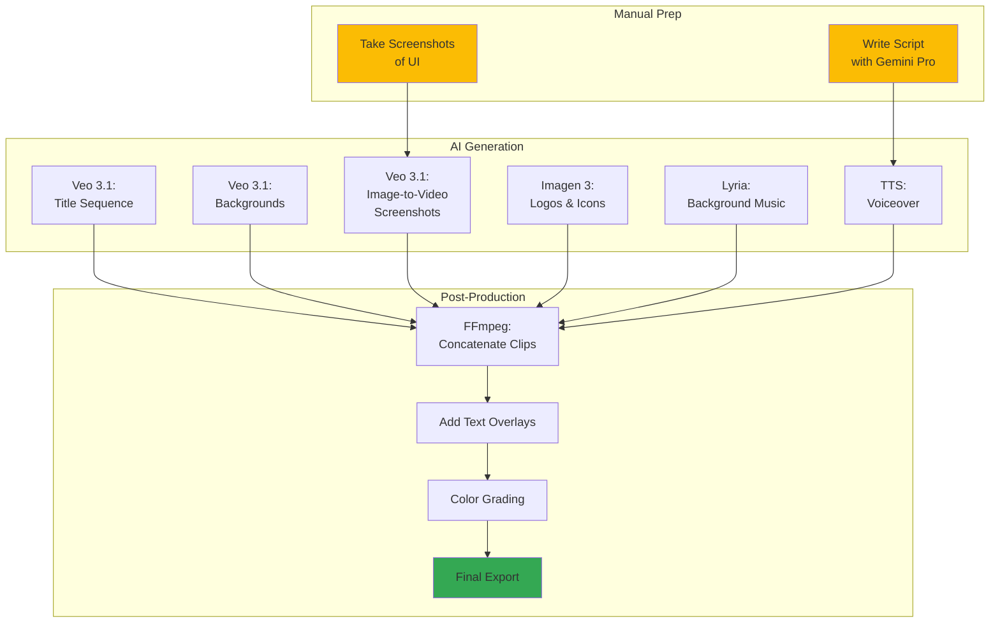

### Generation Code Examples

Each shot below includes Python code showing how to generate it using Gemini 3 APIs. The complete automation script is available at: `/Users/jwegis/Projects/fcp-protocol/video-script.md`

---

## ACT 1: THE HOOK (0:00 - 0:30)

### Shot 1: Opening Title
**Time**: 0:00 - 0:05 (5 seconds)

**Visual**:
```
┌─────────────────────────────────────┐
│                                     │
│         [FCP LOGO FADE IN]          │
│                                     │
│    Food Context Protocol            │
│    AI-Powered Food Intelligence     │
│                                     │
└─────────────────────────────────────┘
```

**Audio**:
> "What if your phone could understand food like a nutritionist?"

**🤖 Generate with Veo 3.1**:
```python
import google.generativeai as genai

genai.configure(api_key="YOUR_API_KEY")

title_video = genai.generate_video(
    model="veo-3.1",
    prompt="""
    Cinematic title sequence for a tech protocol launch.

    Scene: A rotating holographic display of fresh food ingredients
    (colorful vegetables, fruits, grains, proteins) slowly materializing
    from digital particles. As they rotate, they transform into flowing
    data streams and network connections, converging into a central
    glowing protocol symbol (abstract geometric design).

    Style: Modern tech aesthetic, clean and professional
    Lighting: Soft volumetric lighting with blue-green gradients
    Camera: Slow orbital rotation, starting wide and pushing in
    Effects: Subtle particle systems, holographic shimmer
    Color palette: Deep blues, vibrant greens, warm food tones

    Duration: 8 seconds
    Resolution: 1080p, 16:9
    """,
    duration=8,
    resolution="1080p",
    audio_enabled=True  # Native ambient sound
)

title_video.save("assets/01_title_sequence.mp4")
```

**Notes**:
- Veo generates the animation automatically
- Add text overlay in post: "FOOD CONTEXT PROTOCOL"
- Logo from `static/logos/fcp-logo.png` can be composited on top
- Use fade in over 2 seconds

---

### Shot 2: Problem Statement
**Time**: 0:05 - 0:15 (10 seconds)

**Visual**:
```
┌─────────────────────────────────────┐
│  [PHONE TAKING PHOTO OF MEAL]       │
│                                     │
│   Quick cuts (3 sec each):          │
│   1. Phone camera viewfinder        │
│   2. Finger tapping shutter         │
│   3. Photo captured                 │
└─────────────────────────────────────┘
```

**Audio**:
> "FCP uses 15+ Gemini 3 features to transform food photos, voice commands, and videos into instant nutrition insights."

**Notes**:
- Use real phone footage or screen recording
- Show actual food being photographed
- Quick, dynamic editing
- B-roll style

---

### Shot 3: Feature Montage
**Time**: 0:15 - 0:25 (10 seconds)

**Visual**:
```
┌─────────────────────────────────────┐
│  Fast montage (3 seconds each):     │
│                                     │
│  1. Photo → Nutrition breakdown     │
│     [Image] → [Data overlay]        │
│                                     │
│  2. Voice → Meal logged             │
│     [Mic icon] → [Log entry]        │
│                                     │
│  3. Recipe search → Results         │
│     [Search bar] → [Recipe cards]   │
└─────────────────────────────────────┘
```

**Audio**:
> "In the next 3 minutes, I'll show you how Gemini's multimodal AI powers every feature of this platform."

**Notes**:
- Fast cuts, high energy
- Use actual app screenshots/recordings
- Add whoosh transitions between cuts
- Overlay text labels: "Analyze", "Log", "Discover"

---

### Shot 4: Transition to Demo
**Time**: 0:25 - 0:30 (5 seconds)

**Visual**:
```
┌─────────────────────────────────────┐
│                                     │
│   "LET'S SEE IT IN ACTION"          │
│                                     │
│   [FADE TO APP INTERFACE]           │
└─────────────────────────────────────┘
```

**Audio**:
(Voice continues from previous shot)

**Notes**:
- Title card with call-to-action
- Smooth transition to screen recording
- Increase energy in voiceover

---

## ACT 2: THE DEMO (0:30 - 2:30)

### FEATURE 1: Multimodal Image Analysis (0:30 - 1:00)

#### Shot 5: Open App
**Time**: 0:30 - 0:33 (3 seconds)

**Visual**:
```
┌─────────────────────────────────────┐
│   FCP App Dashboard                 │
│                                     │
│   [Camera Icon] highlighted         │
│   Cursor moves → clicks camera      │
└─────────────────────────────────────┘
```

**Audio**:
> "Let's start with Gemini's multimodal vision. I'll take a photo of this chicken salad."

**Notes**:
- Clean browser window (no tabs/bookmarks)
- Highlight cursor movements
- Add subtle zoom on camera icon

---

#### Shot 6: Take Photo
**Time**: 0:33 - 0:38 (5 seconds)

**Visual**:
```
┌─────────────────────────────────────┐
│   Camera Upload Interface           │
│                                     │
│   [UPLOAD BUTTON]                   │
│   → File selected                   │
│   → Image preview appears           │
│                                     │
│   Photo: Chicken Caesar Salad       │
└─────────────────────────────────────┘
```

**Audio**:
> "Gemini analyzes the image using its multimodal API..."

**🤖 Generate with Veo 3.1 (Image-to-Video)**:
```python
# First, capture a screenshot of your upload UI
# Then animate it with Veo's Image-to-Video feature

meal_upload = genai.generate_video_from_image(
    model="veo-3.1",
    source_image="screenshots/upload_interface.png",
    prompt="""
    User clicking upload button in food analysis app.
    Finger taps button, file picker appears, user selects image of
    colorful chicken caesar salad, image preview smoothly fades in.
    Modern app interaction, natural touch gestures, professional UI.
    6 seconds, smooth transitions, 1080p.
    """,
    duration=6,
    resolution="1080p"
)

meal_upload.save("assets/shot06_upload.mp4")
```

**Notes**:
- Take screenshot of actual app UI first
- Veo adds realistic interaction animations
- Can composite real UI elements if needed

---

#### Shot 7: Processing
**Time**: 0:38 - 0:40 (2 seconds)

**Visual**:
```
┌─────────────────────────────────────┐
│                                     │
│    [LOADING SPINNER]                │
│    Analyzing with Gemini...         │
│                                     │
│    Progress indicator               │
└─────────────────────────────────────┘
```

**Audio**:
(Pause for processing - no narration)

**Notes**:
- If processing takes longer, speed up video 2x
- Keep this short (2 seconds max)
- Branded loading animation if available

---

#### Shot 8: Results Display
**Time**: 0:40 - 1:00 (20 seconds)

**Visual**:
```
┌─────────────────────────────────────┐
│   Chicken Caesar Salad [IMAGE]      │
│                                     │
│   📊 Nutrition Facts                │
│   • 450 calories                    │
│   • 35g protein                     │
│   • 28g carbs                       │
│   • 22g fat                         │
│                                     │
│   ⚠️ Allergens Detected             │
│   [DAIRY] [GLUTEN]                  │
│                                     │
│   🥗 Ingredients                     │
│   Romaine, Chicken, Parmesan...     │
└─────────────────────────────────────┘
```

**Audio**:
> "...and instantly breaks down nutrition, detects allergens, and identifies every ingredient. Notice the allergen warnings - Gemini detected dairy and gluten without me telling it what to look for."

**Notes**:
- Results appear with smooth animation
- Zoom in on allergen badges at 0:50
- Highlight each section as it's mentioned
- Add subtle highlighting effect

---

### FEATURE 2: Function Calling (1:00 - 1:30)

#### Shot 9: Voice Command Setup
**Time**: 1:00 - 1:03 (3 seconds)

**Visual**:
```
┌─────────────────────────────────────┐
│   Voice Logging Interface           │
│                                     │
│   [MICROPHONE ICON]                 │
│   "Tap to speak"                    │
│                                     │
│   [Cursor clicks mic]               │
└─────────────────────────────────────┘
```

**Audio**:
> "Now let's use Gemini's function calling. I'll speak naturally..."

**Notes**:
- Switch to voice interface screen
- Clear transition from previous feature
- Mic icon pulses when ready

---

#### Shot 10: Voice Input
**Time**: 1:03 - 1:08 (5 seconds)

**Visual**:
```
┌─────────────────────────────────────┐
│   [AUDIO WAVEFORM ANIMATION]        │
│                                     │
│   🎤 Listening...                   │
│                                     │
│   "Log 3 scrambled eggs             │
│    with toast and coffee."          │
└─────────────────────────────────────┘
```

**Audio**:
> "Log 3 scrambled eggs with toast and coffee."

**Notes**:
- Show animated waveform during speech
- Display transcription text in real-time
- Use your actual voice or AI voiceover

---

#### Shot 11: Split Screen - Processing
**Time**: 1:08 - 1:20 (12 seconds)

**Visual**:
```
┌──────────────────┬──────────────────┐
│ LEFT SIDE        │ RIGHT SIDE       │
│ Voice Input      │ JSON Tool Call   │
│                  │                  │
│ "3 scrambled     │ {                │
│  eggs with       │   "tool":        │
│  toast and       │   "log_meal",    │
│  coffee"         │   "params": {    │
│                  │     "meal_name": │
│                  │     "Scrambled   │
│                  │      Eggs...",   │
│                  │     "calories":  │
│                  │     380,         │
│                  │     "macros": {  │
│                  │       "protein": │
│                  │       24,        │
│                  │       "carbs":   │
│                  │       28,        │
│                  │       "fat": 16  │
│                  │     }            │
│                  │   }              │
│                  │ }                │
└──────────────────┴──────────────────┘
```

**Audio**:
> "Behind the scenes, Gemini is calling our MCP tools - structured functions that enforce typed schemas. No parsing errors, no hallucinations - just structured data that our system can trust."

**Notes**:
- Split screen showing input vs output
- JSON appears with typing animation
- Syntax highlighting for JSON
- Arrow pointing from input to output
- Emphasize the structure and type safety

---

#### Shot 12: Meal Added Confirmation
**Time**: 1:20 - 1:30 (10 seconds)

**Visual**:
```
┌─────────────────────────────────────┐
│   ✅ Meal Logged Successfully        │
│                                     │
│   Scrambled Eggs & Toast            │
│   • 380 calories                    │
│   • Protein: 24g                    │
│   • Carbs: 28g                      │
│   • Fat: 16g                        │
│                                     │
│   [VIEW IN LOG] button              │
└─────────────────────────────────────┘
```

**Audio**:
(Audio from previous shot continues)

**Notes**:
- Success animation (checkmark)
- Show meal added to daily log
- Quick preview, then transition to next feature

---

### FEATURE 3: Google Search Grounding (1:30 - 2:00)

#### Shot 13: Safety Check Interface
**Time**: 1:30 - 1:35 (5 seconds)

**Visual**:
```
┌─────────────────────────────────────┐
│   Food Safety Check                 │
│                                     │
│   [Search Box]                      │
│   "romaine lettuce"                 │
│                                     │
│   [CHECK SAFETY] button             │
└─────────────────────────────────────┘
```

**Audio**:
> "Food safety is critical. Let's use Gemini's grounding with Google Search to check for recalls. Is romaine lettuce safe to eat right now?"

**Notes**:
- Switch to safety check feature
- Type text with keyboard animation
- Cursor clicks search button

---

#### Shot 14: Search Processing
**Time**: 1:35 - 1:38 (3 seconds)

**Visual**:
```
┌─────────────────────────────────────┐
│                                     │
│   🔍 Searching Google...            │
│   Checking FDA database...          │
│                                     │
│   [GROUNDING INDICATOR]             │
│   "Powered by Google Search"        │
└─────────────────────────────────────┘
```

**Audio**:
> "Gemini searches Google in real-time..."

**Notes**:
- Show grounding indicator
- Brief loading state
- Speed up if needed

---

#### Shot 15: Recall Alert Display
**Time**: 1:38 - 1:55 (17 seconds)

**Visual**:
```
┌─────────────────────────────────────┐
│   ⚠️ RECALL ALERT                   │
│                                     │
│   Romaine lettuce from Farm X       │
│   recalled due to E. coli           │
│                                     │
│   📅 Date: 2 days ago               │
│   🔗 Source: FDA.gov                │
│                                     │
│   [VIEW DETAILS] [VISIT FDA.GOV]    │
│                                     │
│   ────────────────────────────      │
│   Citations:                        │
│   • FDA Food Safety Alert #2024-123 │
│   • Updated: Feb 6, 2026            │
│   • Recall Class: I (High Risk)     │
└─────────────────────────────────────┘
```

**Audio**:
> "It found an active recall with citations. This isn't hallucination - it's grounded in real FDA data."

**Notes**:
- Alert appears with warning animation
- Highlight sources/citations section
- Zoom in on FDA.gov link
- Red/orange color scheme for urgency

---

#### Shot 16: Source Verification
**Time**: 1:55 - 2:00 (5 seconds)

**Visual**:
```
┌─────────────────────────────────────┐
│   Browser Opens FDA.gov             │
│                                     │
│   [FDA WEBSITE SCREENSHOT]          │
│   Same recall information visible   │
│                                     │
│   Verified ✓                        │
└─────────────────────────────────────┘
```

**Audio**:
(Audio from previous shot continues, or brief pause)

**Notes**:
- Quick flash to FDA website
- Shows matching information
- Builds credibility
- Return to app interface

---

### FEATURE 4: Gemini Live (2:00 - 2:30)

#### Shot 17: Live Mode Setup
**Time**: 2:00 - 2:03 (3 seconds)

**Visual**:
```
┌─────────────────────────────────────┐
│   Gemini Live                       │
│   Conversational Meal Logging       │
│                                     │
│   [MIC ICON - READY]                │
│   "Speak naturally..."              │
└─────────────────────────────────────┘
```

**Audio**:
> "Finally, Gemini Live enables real-time conversations. Watch this..."

**Notes**:
- Switch to Live interface
- Clean, simple design
- Pulsing mic indicator

---

#### Shot 18: Conversation Flow
**Time**: 2:03 - 2:25 (22 seconds)

**Visual**:
```
┌─────────────────────────────────────┐
│   🗣️ You:                           │
│   "I had salmon for lunch."         │
│                                     │
│   🤖 Gemini:                         │
│   "Great choice! How was it         │
│    prepared - grilled, baked,       │
│    or raw?"                         │
│                                     │
│   🗣️ You:                           │
│   "Grilled with vegetables."        │
│                                     │
│   🤖 Gemini:                         │
│   "Perfect. About how much salmon - │
│    one fillet or more?"             │
│                                     │
│   🗣️ You:                           │
│   "One fillet, maybe 6 ounces."     │
│                                     │
│   🤖 Gemini:                         │
│   "Got it! Logging 6oz grilled      │
│    salmon with vegetables.          │
│    That's about 350 calories.       │
│    Want me to save that?"           │
│                                     │
│   🗣️ You:                           │
│   "Yes."                            │
└─────────────────────────────────────┘
```

**Audio**:
(Actual conversation audio - either recorded or AI-generated with realistic voices)

**You**: "I had salmon for lunch."

**Gemini**: "Great choice! How was it prepared - grilled, baked, or raw?"

**You**: "Grilled with vegetables."

**Gemini**: "Perfect. About how much salmon - one fillet or more?"

**You**: "One fillet, maybe 6 ounces."

**Gemini**: "Got it! Logging 6oz grilled salmon with vegetables. That's about 350 calories. Want me to save that?"

**You**: "Yes."

**Notes**:
- Chat bubble interface
- Messages appear in sequence
- Audio waveform during speaking
- Natural conversation pace
- Show typing indicators for Gemini
- Emphasize the back-and-forth nature

---

#### Shot 19: Auto-logged Result
**Time**: 2:25 - 2:30 (5 seconds)

**Visual**:
```
┌─────────────────────────────────────┐
│   ✅ Meal Logged                     │
│                                     │
│   Grilled Salmon with Vegetables    │
│   • 6 oz salmon                     │
│   • ~350 calories                   │
│   • Protein: 42g                    │
│   • Prepared: Grilled               │
│                                     │
│   All details captured from         │
│   conversation                      │
└─────────────────────────────────────┘
```

**Audio**:
> "Gemini Live asks clarifying questions like a real nutritionist, then auto-fills everything based on context."

**Notes**:
- Success confirmation
- Highlight auto-filled fields
- Show how all details were extracted from conversation

---

## ACT 3: THE IMPACT (2:30 - 3:00)

### Shot 20: Dashboard Overview
**Time**: 2:30 - 2:40 (10 seconds)

**Visual**:
```
┌─────────────────────────────────────┐
│   My Food Log - Past 7 Days         │
│                                     │
│   Mon: Grilled Salmon (350 cal)     │
│   Mon: Chicken Salad (450 cal)      │
│   Mon: Scrambled Eggs (380 cal)     │
│   Tue: ...                          │
│   Wed: ...                          │
│                                     │
│   📊 Weekly Stats:                  │
│   Total Meals: 21                   │
│   Avg Calories: 1,850/day           │
│   Top Cuisine: Italian              │
└─────────────────────────────────────┘
```

**Audio**:
> "FCP transforms manual food tracking into an intelligent conversation. We're using 15+ Gemini 3 features:"

**Notes**:
- Show populated dashboard
- Scroll through recent meals
- Display analytics/charts
- Demonstrate value proposition

---

### Shot 21: Feature List
**Time**: 2:40 - 2:48 (8 seconds)

**Visual**:
```
┌─────────────────────────────────────┐
│   Powered by Gemini 3:              │
│                                     │
│   ✅ Multimodal image & audio       │
│   ✅ Function calling (40+ tools)   │
│   ✅ Google Search grounding        │
│   ✅ Extended thinking               │
│   ✅ Code execution                  │
│   ✅ Gemini Live API                 │
│   ✅ Context caching                 │
│   ✅ Video processing                │
│   ✅ Deep research                   │
│   ✅ ...and 6 more!                  │
└─────────────────────────────────────┘
```

**Audio**:
(Audio continues from previous shot)

**Notes**:
- Animate list items appearing
- Checkmarks animate in
- Keep text on screen long enough to read
- Quick but readable pace

---

### Shot 22: Architecture Highlight
**Time**: 2:48 - 2:53 (5 seconds)

**Visual**:
```
┌─────────────────────────────────────┐
│   Developer-Friendly Architecture   │
│                                     │
│   REST API        MCP Interface     │
│   ┌─────────┐    ┌─────────┐       │
│   │ POST /  │    │ stdio   │       │
│   │ analyze │    │ JSON-RPC│       │
│   └─────────┘    └─────────┘       │
│                                     │
│   • 40+ typed tools                 │
│   • 100% test coverage              │
│   • Fern-generated SDKs             │
└─────────────────────────────────────┘
```

**Audio**:
> "The platform exposes both REST and MCP interfaces, making it easy for developers to integrate."

**Notes**:
- Split screen showing both interfaces
- Code snippets if time permits
- Emphasize developer experience

---

### Shot 23: Production Quality
**Time**: 2:53 - 2:57 (4 seconds)

**Visual**:
```
┌─────────────────────────────────────┐
│   Production-Grade Features         │
│                                     │
│   ✓ Typed schemas (Pydantic)        │
│   ✓ Error handling                  │
│   ✓ Rate limiting                   │
│   ✓ 100% test coverage              │
│   ✓ 2,861 passing tests             │
└─────────────────────────────────────┘
```

**Audio**:
> "Every feature is production-grade - typed schemas, error handling, rate limiting, and 100% test coverage."

**Notes**:
- Quick list of quality indicators
- Build confidence in implementation
- Professional presentation

---

### Shot 24: Call to Action
**Time**: 2:57 - 3:00 (3 seconds)

**Visual**:
```
┌─────────────────────────────────────┐
│                                     │
│   Try it yourself (no login!)       │
│   🔗 api.fcp.dev                    │
│                                     │
│   View Code                         │
│   💻 github.com/Food-Context-       │
│      Protocol/fcp-gemini-server     │
│                                     │
│   [FCP LOGO]                        │
│   AI-powered food intelligence,     │
│   built on Gemini 3                 │
└─────────────────────────────────────┘
```

**Audio**:
> "Try it yourself at api.fcp.dev - no login required."

**Notes**:
- Large, readable URLs
- QR codes optional
- FCP logo returns
- Clean end screen
- Hold for 3 full seconds

---

## END SCREEN (3:00 - 3:05)

### Shot 25: Credits & Links
**Time**: 3:00 - 3:05 (5 seconds - YouTube allows this)

**Visual**:
```
┌─────────────────────────────────────┐
│   FCP                               │
│   Food Context Protocol             │
│                                     │
│   🔗 Demo: api.fcp.dev              │
│   💻 Code: github.com/Food-Context- │
│           Protocol                  │
│   📧 Contact: [your-email]          │
│                                     │
│   Built for Gemini API Developer    │
│   Competition 2026                  │
└─────────────────────────────────────┘
```

**Audio**:
(Background music continues, no voiceover)

**Notes**:
- Static end card
- Music fades out
- All links visible for YouTube annotations
- Submission info included

---

## TECHNICAL SPECIFICATIONS

### Recording Setup
- **Resolution**: 1920×1080 (minimum)
- **Frame Rate**: 30fps or 60fps
- **Screen Recorder**: QuickTime (Mac), OBS (Windows/Linux)
- **Audio**:
  - Microphone: AirPods or better (not laptop mic)
  - Bitrate: 192 kbps AAC
  - Record separately for easier editing

### Browser Setup
- **Window Size**: 1280×720 or 1920×1080
- **Clean Environment**:
  - No browser tabs visible
  - No bookmarks bar
  - Hide desktop icons
  - Incognito/private mode
  - Turn off notifications

### Editing Notes
- **Software**: iMovie (free), DaVinci Resolve (free), Final Cut Pro (paid)
- **Background Music**: Low volume, no lyrics, royalty-free
- **Transitions**: Quick cuts (0.5s max), occasional whoosh for emphasis
- **Speed Adjustments**:
  - Loading screens: 1.5-2x speed
  - Normal narration: 1x speed
  - Keep total under 3:00
- **Text Overlays**:
  - Sans-serif font (Arial, Helvetica, Roboto)
  - High contrast for readability
  - Appear with subtle animation

### Export Settings
- **Format**: MP4 (H.264)
- **Resolution**: 1920×1080
- **Bitrate**: 8-10 Mbps
- **Audio**: AAC, 192 kbps

---

## SHOT CHECKLIST

Before recording each section:

**Act 1: Hook**
- [ ] FCP logo file ready
- [ ] Phone camera footage captured (or stock)
- [ ] Montage clips prepared
- [ ] Opening narration practiced

**Act 2: Demo**
- [ ] Image analysis feature working
- [ ] Test food photo uploaded
- [ ] Voice recording ready for function calling demo
- [ ] FDA recall example prepared
- [ ] Gemini Live conversation scripted/recorded

**Act 3: Impact**
- [ ] Dashboard populated with sample data
- [ ] Feature list graphics prepared
- [ ] Architecture diagrams ready
- [ ] End screen with all links prepared

**Post-Production**
- [ ] All segments recorded
- [ ] Voiceover recorded separately
- [ ] Background music selected
- [ ] Test export under 3:00
- [ ] Audio levels balanced
- [ ] Thumbnail created (1280×720)

---

## ALTERNATIVE TAKES

### Quick Version (For Practice)
Record each feature demo separately:
1. Image analysis only (30s)
2. Function calling only (30s)
3. Grounding only (30s)
4. Live API only (30s)

Then combine with intro/outro.

### Backup Plan
If live demos fail:
- Pre-record all feature demonstrations
- Use screen recordings from successful test runs
- Edit together with voiceover added in post

### Multiple Camera Angles
If showing phone + computer:
- Overhead shot of phone taking photo
- Screen recording of upload process
- Picture-in-picture composition

---

## JUDGING CRITERIA ALIGNMENT

The storyboard addresses key criteria:

✅ **Functionality** - Shows 4 features working live
✅ **Technical Depth** - Reveals 15+ Gemini features
✅ **Innovation** - Demonstrates unique combinations (grounding + safety)
✅ **Polish** - Professional presentation, clear narrative
✅ **Impact** - Real-world use case (food safety)

---

## FINAL NOTES

**Pacing**:
- Total word count: ~400 words
- Speaking rate: 140-160 words/minute
- Actual speaking time: ~2:30 (leaves room for pauses/visuals)

**Energy**:
- Start high energy (hook)
- Maintain enthusiasm during demo
- Build to inspiring conclusion

**Authenticity**:
- Use actual working features
- Real data where possible
- Honest about capabilities

**Call-to-Action**:
- Repeated twice (during demo and end screen)
- No login required (removes friction)
- Source code available (transparency)

---

## 🎨 Feature Demo Sequence

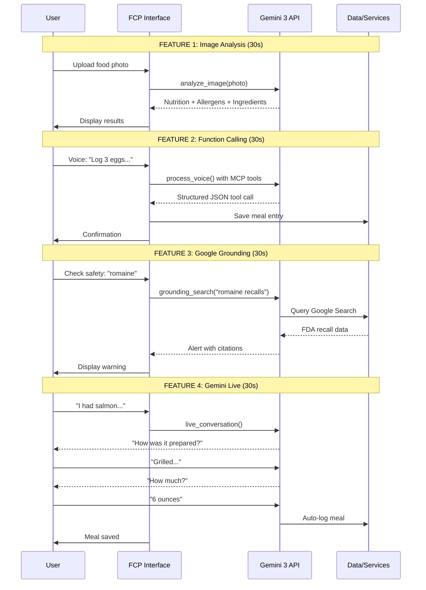

## 🎯 Shot Complexity Matrix

```mermaid
quadrantChart
    title Shot Complexity vs Impact
    x-axis Low Production Effort --> High Production Effort
    y-axis Low Judge Impact --> High Judge Impact
    quadrant-1 High Impact, High Effort
    quadrant-2 High Impact, Low Effort
    quadrant-3 Low Impact, Low Effort
    quadrant-4 Low Impact, High Effort

    Opening Title: [0.3, 0.8]
    Problem Statement: [0.5, 0.7]
    Feature Montage: [0.7, 0.9]
    Image Analysis: [0.6, 0.95]
    Function Calling: [0.8, 0.95]
    Google Grounding: [0.7, 0.9]
    Gemini Live: [0.85, 0.95]
    Dashboard: [0.4, 0.6]
    Feature List: [0.3, 0.7]
    Architecture: [0.5, 0.65]
    CTA: [0.2, 0.8]
```

## 📱 Screen Recording Checklist Flow

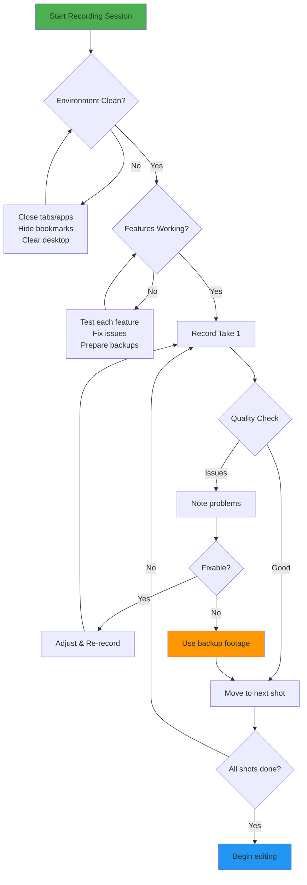

## 🎤 Audio Recording Strategy

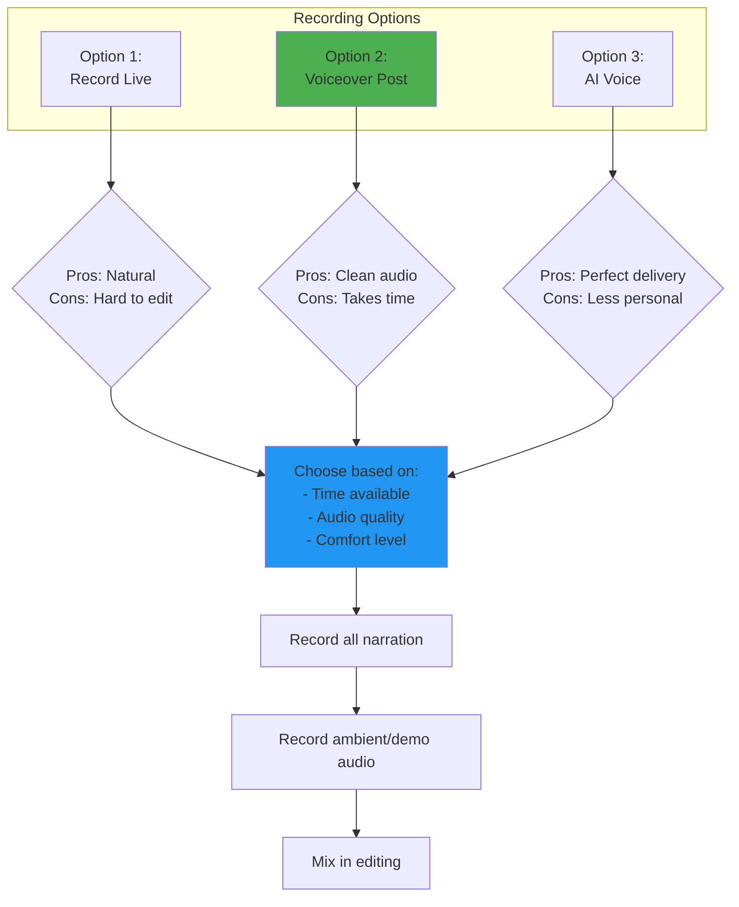

## 📊 Demo Data Requirements

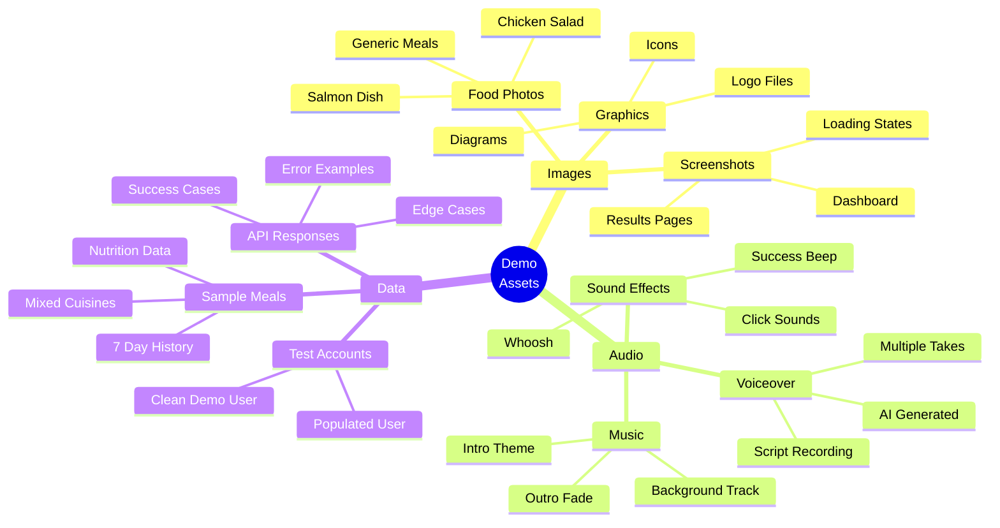

## 🚀 Post-Production Workflow

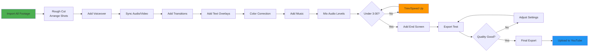

---

## 🎬 Quick Reference: Shot-by-Shot Timings

| Shot | Time | Duration | Scene | Key Visual | Audio |
|------|------|----------|-------|------------|-------|
| 1 | 0:00 | 5s | Logo | FCP logo fade in | "What if your phone..." |
| 2 | 0:05 | 10s | Hook | Phone camera | "15+ Gemini features..." |
| 3 | 0:15 | 10s | Montage | 3 quick cuts | "In the next 3 minutes..." |
| 4 | 0:25 | 5s | Transition | Title card | (continues) |
| 5-8 | 0:30 | 30s | Demo 1 | Image analysis | "Multimodal vision..." |
| 9-12 | 1:00 | 30s | Demo 2 | Function calling | "Structured tools..." |
| 13-16 | 1:30 | 30s | Demo 3 | Grounding | "Food safety..." |
| 17-19 | 2:00 | 30s | Demo 4 | Live API | Conversation |
| 20 | 2:30 | 10s | Dashboard | 7-day log | "Intelligent conversation..." |
| 21 | 2:40 | 8s | Features | Checklist | (continues) |
| 22 | 2:48 | 5s | Architecture | REST/MCP | "Developer-friendly..." |
| 23 | 2:53 | 4s | Quality | Test stats | "Production-grade..." |
| 24 | 2:57 | 3s | CTA | URLs + logo | "Try it yourself..." |
| 25 | 3:00 | 5s | End | Credits | (music fade) |

---

## 📋 DETAILED PRODUCTION PLAN

### Overview

This plan outlines a complete workflow for creating a 3-minute demo video using Gemini 3 technologies. Estimated total time: **20-25 hours** over 5 days.

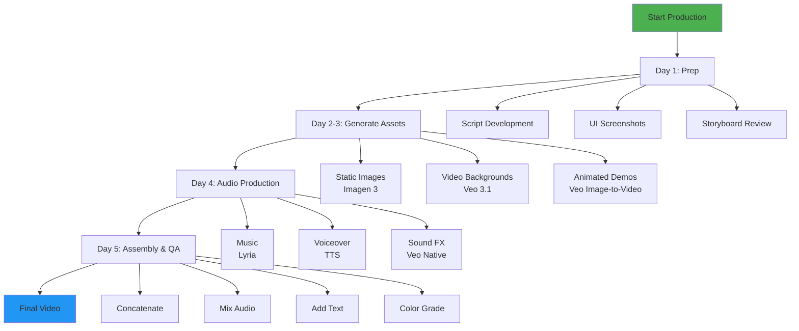

---

### DAY 1: PRE-PRODUCTION (5 hours)

#### Morning Session (3 hours)

**Task 1.1: Script Refinement with Gemini 3 Pro**
- [ ] Load all project docs into Gemini 3 Pro
- [ ] Use Extended Thinking mode for narrative structure
- [ ] Generate scene-by-scene script with timings
- [ ] Review and edit for 3-minute target

```python
# Script generation prompt
script_prompt = """
Context: Creating a 3-minute demo video for Food Context Protocol (FCP)

Requirements:
- Must explain problem, solution, demo features, and call-to-action
- Target: Devpost hackathon judges
- Showcase 15+ Gemini 3 features used in FCP
- Professional tone, developer audience

Generate a complete script with:
1. Narration text for each 15-second segment
2. Visual descriptions for Veo generation
3. Timing breakdowns
4. Technical callouts

Structure:
- 0:00-0:30: Hook (problem statement)
- 0:30-2:30: Demo (4 features, 30 sec each)
- 2:30-3:00: Impact & CTA
"""

script = genai.generate_content(
    model="gemini-3-flash-thinking",
    contents=script_prompt,
    thinking_config={"thinking_budget": 60}
)
```

**Task 1.2: UI Screenshot Capture**
- [ ] Set up clean demo environment
  - [ ] Clear browser cache/history
  - [ ] Hide bookmarks/extensions
  - [ ] Use incognito mode
  - [ ] Disable notifications
- [ ] Capture screenshots at 1920×1080:
  - [ ] Dashboard/homepage
  - [ ] Meal analysis interface (before/after)
  - [ ] Voice logging interface
  - [ ] Food safety check results
  - [ ] Gemini Live conversation
  - [ ] API documentation page
- [ ] Organize in `screenshots/` directory
- [ ] Name clearly: `01_dashboard.png`, `02_meal_analysis_input.png`, etc.

**Task 1.3: Create Asset Inventory**
```markdown
# Asset Checklist

## To Generate with AI
- [ ] 01_title_sequence.mp4 (Veo 3.1) - 8 sec
- [ ] 02_problem_bg.mp4 (Veo 3.1) - 10 sec
- [ ] 03_solution_bg.mp4 (Veo 3.1) - 15 sec
- [ ] 04-07_demo_bgs.mp4 (Veo 3.1) - 30 sec each
- [ ] 08_impact_bg.mp4 (Veo 3.1) - 10 sec
- [ ] 09_cta_bg.mp4 (Veo 3.1) - 15 sec

## Static Assets (Imagen 3)
- [ ] fcp_logo.png - Main logo
- [ ] gemini_badge.png - "Powered by" badge
- [ ] architecture_diagram.png - System architecture
- [ ] icon_nutrition.png - Feature icon
- [ ] icon_recipes.png - Feature icon
- [ ] icon_safety.png - Feature icon
- [ ] icon_live_api.png - Feature icon

## Audio Assets
- [ ] background_music.mp3 (Lyria) - 180 sec
- [ ] vo_intro.mp3 (TTS) - ~15 sec
- [ ] vo_demo.mp3 (TTS) - ~90 sec
- [ ] vo_impact.mp3 (TTS) - ~20 sec
- [ ] vo_cta.mp3 (TTS) - ~10 sec
```

#### Afternoon Session (2 hours)

**Task 1.4: Create FFmpeg Timeline Specification**

```python
# Define complete video timeline
video_timeline = {
    "total_duration": 180,  # 3 minutes
    "segments": [
        {
            "id": 1,
            "name": "title_sequence",
            "file": "assets/01_title_sequence.mp4",
            "start_time": 0,
            "duration": 8,
            "audio_tracks": ["background_music.mp3"],
            "overlays": [
                {
                    "type": "text",
                    "content": "FOOD CONTEXT PROTOCOL",
                    "font": "Inter-Bold",
                    "size": 72,
                    "color": "white",
                    "position": "center",
                    "fade_in": 2.0,
                    "fade_out": 1.0,
                    "start": 2,
                    "duration": 4
                }
            ]
        },
        {
            "id": 2,
            "name": "hook",
            "file": "assets/02_problem_bg.mp4",
            "start_time": 8,
            "duration": 22,
            "audio_tracks": ["background_music.mp3", "vo_intro.mp3"],
            "overlays": [
                {
                    "type": "text",
                    "content": "What if your phone could understand\nfood like a nutritionist?",
                    "style": "subtitle",
                    "position": "lower_third"
                }
            ]
        },
        # ... (continue for all 25 shots)
    ]
}

# Save timeline
import json
with open("video_timeline.json", "w") as f:
    json.dump(video_timeline, f, indent=2)
```

**Task 1.5: Test Gemini API Access**
```python
# Verify all APIs are accessible
import google.generativeai as genai

genai.configure(api_key=os.getenv("GEMINI_API_KEY"))

# Test Veo
test_video = genai.generate_video(
    model="veo-3.1-fast",
    prompt="Simple test: camera slowly zooming into a red apple on white background, 3 seconds",
    duration=3,
    resolution="720p"  # Use 720p for testing
)
print("✓ Veo API working")

# Test Imagen
test_image = genai.generate_image(
    model="imagen-3",
    prompt="Simple test icon: A blue circle with white checkmark",
    aspect_ratio="1:1"
)
print("✓ Imagen API working")

# Test TTS
from google.cloud import texttospeech
client = texttospeech.TextToSpeechClient()
print("✓ TTS API working")
```

---

### DAY 2: STATIC ASSETS & BACKGROUNDS (5 hours)

#### Morning Session (3 hours)

**Task 2.1: Generate All Static Assets with Imagen 3**

```python
# Detailed prompts for each asset
imagen_prompts = {
    "fcp_logo": {
        "prompt": """
        Professional technology logo for 'Food Context Protocol' (FCP).

        Design elements:
        - Central icon: Abstract fusion of a fork silhouette and data flow lines
        - Fork transforms into flowing network connections at the tips
        - Geometric, modern, minimalist aesthetic
        - Forms an abstract 'F' shape

        Typography:
        - 'FCP' in bold, modern sans-serif (like Inter or Poppins)
        - 'Food Context Protocol' underneath in lighter weight
        - Clean, professional tech brand feel

        Color scheme:
        - Primary: Fresh green (#4CAF50) transitioning to tech blue (#2196F3)
        - Use gradient for the fork/data icon
        - Text in dark gray (#212121)

        Layout:
        - Icon above text, centered
        - Scalable design, works at any size
        - Plenty of whitespace
        - Square format with transparent background

        Style: Flat design, modern tech startup aesthetic, reminiscent of
        Stripe, Vercel, or GitHub logos. Clean, professional, scalable.
        """,
        "aspect_ratio": "1:1",
        "quality": "high"
    },

    "gemini_badge": {
        "prompt": """
        'Powered by Gemini 3' badge for video overlay.

        Design:
        - Horizontal rectangular badge with rounded corners (30px radius)
        - Width: 300px, Height: 80px
        - Semi-transparent dark background: rgba(26, 35, 126, 0.9)
        - Subtle glow effect around edges: soft blue (#4285F4) glow

        Content:
        - Left side: Google Gemini sparkle icon (colorful, recognizable)
        - Right side: Text in two lines
          - Line 1: "POWERED BY" (small, uppercase, light gray)
          - Line 2: "Gemini 3" (larger, white, bold)

        Style:
        - Google brand colors (blue #4285F4, red #EA4335, yellow #FBBC04, green #34A853)
        - Modern, professional, suitable for video corner overlay
        - High contrast for visibility over various backgrounds
        """,
        "aspect_ratio": "4:1",
        "quality": "high"
    },

    "architecture_diagram": {
        "prompt": """
        Technical architecture diagram for Food Context Protocol (FCP).

        Layout (horizontal, left-to-right flow):

        TOP TIER - Client Applications:
        - Mobile app icon (smartphone symbol)
        - Web browser icon (browser window symbol)
        - CLI terminal icon (command line symbol)
        - Claude Desktop icon (stylized AI assistant)
        Arranged horizontally with equal spacing

        MIDDLE TIER - FCP Server:
        - Large central rounded rectangle labeled "FCP SERVER"
        - Two bidirectional arrows coming down from clients:
          - Left arrow labeled "MCP stdio"
          - Right arrow labeled "REST HTTP"
        - Internal icons showing: Database, API Router, Tool Registry

        BOTTOM TIER - Gemini 3 Services:
        - Six icons representing features:
          - Eye icon: "Vision"
          - Magnifying glass: "Grounding"
          - Brain icon: "Thinking"
          - Code brackets: "Code Execution"
          - Microphone: "Live API"
          - Layers: "Context Caching"
        - Arrows flowing up to FCP Server

        Style:
        - Clean, professional technical diagram
        - Color coding:
          - Clients: Blue (#2196F3)
          - FCP Server: Green (#4CAF50)
          - Gemini: Orange/Red gradient (#FF9800 to #F44336)
        - White or light gray background (#FAFAFA)
        - Icons: Simple, line-art style, consistent thickness
        - Text: Sans-serif, clear hierarchy (16pt for labels, 12pt for descriptions)
        - Arrows: Solid lines with arrowheads, labeled clearly
        - Subtle drop shadows for depth

        Format: Wide horizontal layout (16:9 aspect ratio), suitable for
        full-screen video presentation. High resolution for clarity when displayed.
        """,
        "aspect_ratio": "16:9",
        "quality": "high"
    },

    "icon_nutrition": {
        "prompt": """
        Feature icon representing nutrition analysis.

        Design: Circular badge with fork and magnifying glass examining food.
        - Magnifying glass positioned over a fork silhouette
        - Inside magnifying glass: simplified food molecule structure
        - Clean line art style, monochromatic

        Style:
        - Single color: Dark teal (#00695C)
        - Line weight: 4px, consistent throughout
        - 512×512px canvas, transparent background
        - Padding: 64px from edges
        - Modern, minimal, UI icon aesthetic
        """,
        "aspect_ratio": "1:1",
        "quality": "high"
    },

    "icon_recipes": {
        "prompt": """
        Feature icon representing recipe search and discovery.

        Design: Open cookbook with search magnifying glass icon.
        - Book/cookbook shown open with visible pages
        - Magnifying glass overlapping one page
        - Subtle food icons on pages (carrot, apple)

        Style:
        - Single color: Deep orange (#E65100)
        - Line weight: 4px (matches nutrition icon)
        - 512×512px, transparent background
        - Consistent with other feature icons
        """,
        "aspect_ratio": "1:1",
        "quality": "high"
    },

    "icon_safety": {
        "prompt": """
        Feature icon representing food safety checking.

        Design: Shield with checkmark and alert badge.
        - Security shield outline
        - Large checkmark in center
        - Small alert badge in top-right corner

        Style:
        - Single color: Safety red (#C62828)
        - Line weight: 4px
        - 512×512px, transparent background
        - Conveys protection and alerts
        """,
        "aspect_ratio": "1:1",
        "quality": "high"
    },

    "icon_live_api": {
        "prompt": """
        Feature icon representing Gemini Live conversational interface.

        Design: Microphone with sound waves and chat bubble.
        - Microphone icon in center
        - Sound waves emanating from both sides
        - Speech bubble overlapping slightly

        Style:
        - Single color: Gemini blue (#4285F4)
        - Line weight: 4px
        - 512×512px, transparent background
        - Dynamic, conversational feel
        """,
        "aspect_ratio": "1:1",
        "quality": "high"
    }
}

# Generate all images
for name, config in imagen_prompts.items():
    print(f"Generating {name}...")

    image = genai.generate_image(
        model="imagen-3",
        prompt=config["prompt"],
        aspect_ratio=config["aspect_ratio"],
        quality=config["quality"]
    )

    output_path = f"assets/{name}.png"
    image.save(output_path)
    print(f"✓ Saved to {output_path}")

    time.sleep(3)  # Rate limiting
```

#### Afternoon Session (2 hours)

**Task 2.2: Generate Background Videos with Veo 3.1**

```python
# Detailed prompts for each background
veo_backgrounds = {
    "02_problem_bg": {
        "prompt": """
        Slow camera pan across a modern home kitchen counter in natural daylight.

        Scene setup:
        - Clean, minimalist kitchen with white/light gray countertops
        - Fresh ingredients scattered naturally: colorful vegetables, fruits
        - Wooden cutting board with knife
        - Smartphone laying face-up on counter (modern iPhone or Android)
        - Natural window lighting from left side, soft shadows

        Camera movement:
        - Starts wide on left showing window and ingredient array
        - Slow horizontal pan right (dolly movement, NOT handheld)
        - Ends focused on smartphone in foreground
        - Smooth, cinematic camera movement (no shake)

        Color grading:
        - Slightly desaturated (0.8x saturation)
        - Warm color temperature suggesting morning light
        - Shallow depth of field (f/2.8), background soft blur

        Mood: Thoughtful, contemplative, suggesting a problem to solve
        Duration: 10 seconds
        Resolution: 1080p, 16:9
        """,
        "duration": 10,
        "resolution": "1080p",
        "audio_enabled": True
    },

    "03_solution_bg": {
        "prompt": """
        Abstract visualization of a distributed network system forming connections.

        Visual elements:
        - Starts with isolated geometric nodes (spheres) scattered in 3D space
        - Nodes begin connecting with animated lines (network edges)
        - Lines flow with subtle particle animation showing data transfer
        - Nodes pulse gently when connections form
        - Network gradually becomes interconnected (not fully, ~60% connected)

        Technical style:
        - Dark background (#0A192F, deep blue-black)
        - Nodes: Glowing cyan (#00D4AA) with soft glow
        - Connection lines: Bright cyan with subtle white core
        - Particles: White with cyan trail
        - Depth of field: Foreground nodes sharp, background slightly blurred

        Camera:
        - Slow orbital rotation around the network (15-degree arc)
        - Subtle push-in (dolly forward) throughout
        - Smooth, professional motion graphics style

        Mood: Innovative, connective, problem solved, technical elegance
        Duration: 15 seconds
        Resolution: 1080p, 16:9
        """,
        "duration": 15,
        "resolution": "1080p",
        "audio_enabled": False
    },

    "04_demo_image_analysis_bg": {
        "prompt": """
        Over-the-shoulder POV of hands using smartphone to photograph a meal.

        Scene:
        - Modern restaurant table setting, natural wood table
        - Colorful, appetizing meal in center: grilled salmon with vegetables
        - Hands holding modern smartphone, positioned to photograph meal
        - Restaurant ambient lighting: warm, slightly dimmed (evening ambiance)
        - Subtle bokeh from restaurant lights in far background

        Action:
        - Hands position phone above meal
        - Camera (our view) shows phone screen capturing the meal
        - Phone screen shows UI overlay: "Analyzing..." text appears
        - Professional product photography style

        Camera:
        - Steady, over-shoulder angle (~45 degrees from vertical)
        - Focus on phone and meal (sharp), background soft
        - No camera movement (locked tripod shot)
        - Depth of field: f/2.0

        Duration: 12 seconds
        Resolution: 1080p, 16:9
        """,
        "duration": 12,
        "resolution": "1080p",
        "audio_enabled": True
    },

    # ... Continue with remaining backgrounds
}

# Generate all background videos
for name, config in veo_backgrounds.items():
    print(f"Generating {name}...")

    video = genai.generate_video(
        model="veo-3.1",
        prompt=config["prompt"],
        duration=config["duration"],
        resolution=config["resolution"],
        audio_enabled=config.get("audio_enabled", False)
    )

    output_path = f"assets/{name}.mp4"
    video.save(output_path)
    print(f"✓ Saved to {output_path}")

    time.sleep(10)  # Rate limiting for Veo (longer wait)
```

---

### DAY 3: ANIMATED DEMOS (6 hours)

**Task 3.1: Convert UI Screenshots to Animated Videos**

Use Veo's **Image-to-Video** feature to add professional motion to static screenshots.

```python
# Screenshot animation specifications
screenshot_animations = {
    "meal_analysis_input": {
        "screenshot": "screenshots/02_meal_analysis_input.png",
        "prompt": """
        Animate this food analysis interface screenshot.

        Animation sequence:
        1. Start static for 1 second
        2. User's finger enters from bottom-right
        3. Finger taps "Upload Photo" button with ripple effect
        4. Button highlights (pressed state)
        5. File picker dialog slides up from bottom
        6. Image thumbnail of chicken salad fades in
        7. "Analyze" button pulses gently (call to action)

        Style:
        - Realistic touch interactions (finger shadow, button press)
        - Smooth UI transitions (ease-in-out curves)
        - Professional app demo aesthetic
        - Keep colors and branding from screenshot

        Camera: Static, no camera movement (pure UI animation)
        Duration: 6 seconds
        Resolution: 1080p
        """,
        "duration": 6
    },

    "meal_analysis_results": {
        "screenshot": "screenshots/03_meal_analysis_results.png",
        "prompt": """
        Animate this nutrition results display.

        Animation sequence:
        1. Start with blank result area
        2. Meal photo fades in at top
        3. Nutrition cards slide in from right, one by one:
           - Calories card (0.5s delay)
           - Protein/carbs/fat card (1.0s delay)
           - Allergen warning badges (1.5s delay)
           - Ingredients list (2.0s delay)
        4. Each card has subtle bounce on entry
        5. Allergen badges pulse gently (attention grabbing)
        6. Hold final frame for 2 seconds

        Style:
        - Material Design-style elevation (subtle shadows)
        - Smooth staggered animations
        - Professional data visualization

        Camera: Slow subtle zoom in (1.05x) throughout
        Duration: 8 seconds
        Resolution: 1080p
        """,
        "duration": 8
    },

    "voice_logging_ui": {
        "screenshot": "screenshots/05_voice_logging.png",
        "prompt": """
        Animate this voice logging interface.

        Animation:
        1. Microphone icon pulses (idle state)
        2. User taps microphone button
        3. Microphone icon turns red (recording)
        4. Audio waveform animates below mic (realistic voice pattern)
        5. Transcribed text appears word-by-word:
           "Log 3 scrambled eggs with toast and coffee"
        6. Processing spinner appears briefly
        7. Success checkmark with subtle particle burst

        Style:
        - Natural voice interaction feedback
        - Smooth typing animation for text
        - Satisfying success animation

        Duration: 10 seconds
        Resolution: 1080p
        """,
        "duration": 10
    },

    "function_calling_split": {
        "screenshot": "screenshots/06_function_calling.png",
        "prompt": """
        Animate this split-screen function calling visualization.

        Left side (Voice Input):
        - Text appears word-by-word with typing effect
        - Voice waveform pulses in sync with text appearing

        Right side (JSON Output):
        - JSON structure builds line-by-line with syntax highlighting
        - Each key-value pair appears with subtle fade-in
        - Cursor blinks at end of each line briefly
        - Number values count up smoothly (e.g., 380 calories)

        Connecting element:
        - Animated arrow flows from left to right midway through
        - Data particles flow along arrow path

        Style:
        - Code editor aesthetic (VS Code-like)
        - Smooth, technical, developer-focused

        Duration: 12 seconds
        Resolution: 1080p
        """,
        "duration": 12
    },

    "safety_alert": {
        "screenshot": "screenshots/08_safety_alert.png",
        "prompt": """
        Animate this food safety recall alert.

        Animation:
        1. Alert notification slides down from top (push notification)
        2. Notification has subtle shake (2-3 frames, attention-grabbing)
        3. User finger taps notification
        4. Screen transitions to full alert view (slide up transition)
        5. Alert details fade in sequentially:
           - Warning icon with pulse
           - "RECALL ALERT" header
           - Product name and reason
           - Source citations with badges
        6. "View Details" button pulses

        Style:
        - Urgent but professional (red/orange color theme)
        - Smooth mobile app transitions
        - Clear information hierarchy

        Duration: 8 seconds
        Resolution: 1080p (or 9:16 for mobile portrait)
        """,
        "duration": 8
    }
}

# Generate animated demos from screenshots
for name, config in screenshot_animations.items():
    print(f"Converting {name} screenshot to video...")

    video = genai.generate_video_from_image(
        model="veo-3.1",
        source_image=config["screenshot"],
        prompt=config["prompt"],
        duration=config["duration"],
        resolution="1080p"
    )

    output_path = f"assets/demo_{name}.mp4"
    video.save(output_path)
    print(f"✓ Saved to {output_path}")

    time.sleep(10)  # Rate limiting
```

**Task 3.2: Generate Feature Showcase Videos (Text-to-Video)**

For features you don't have screenshots of, generate from scratch:

```python
feature_showcases = {
    "gemini_live_conversation": {
        "prompt": """
        Mobile app interface showing real-time conversational AI interaction.

        Scene:
        - Clean chat interface (like iMessage aesthetic)
        - Alternating user messages (blue bubbles, right-aligned)
        - AI responses (gray bubbles, left-aligned)

        Conversation sequence:
        User: "I had salmon for lunch"
        AI: "Great choice! How was it prepared?"
        User: "Grilled with vegetables"
        AI: "Perfect. About how much salmon?"
        User: "One fillet, maybe 6 ounces"
        AI: "Got it! Logging now..."

        Animation:
        - Each message appears with smooth slide-in + fade
        - Typing indicator (three dots) before AI responses
        - Messages stack naturally like real chat app
        - Subtle keyboard appearance/disappearance

        Style: iOS-style modern chat interface, clean and minimal
        Duration: 15 seconds
        Resolution: 1080p (or 9:16 portrait)
        """,
        "duration": 15
    },

    "dashboard_overview": {
        "prompt": """
        Food logging dashboard showing 7-day meal history.

        Visual:
        - Top: Weekly calendar view with meal dots
        - Middle: Today's meals as cards with food photos
        - Bottom: Nutrition stats (calories, macros) as bar charts

        Animation:
        - Calendar week scrolls in from left
        - Meal cards fade in one by one (staggered)
        - Chart bars animate upward (fill animation)
        - Total calorie counter counts up smoothly

        Style:
        - Modern health app aesthetic (like MyFitnessPal)
        - Color-coded: Green for veggies, Red for protein, Yellow for carbs
        - Clean, professional data visualization

        Duration: 10 seconds
        Resolution: 1080p
        """,
        "duration": 10
    }
}

# Generate feature videos
for name, config in feature_showcases.items():
    print(f"Generating {name} showcase...")

    video = genai.generate_video(
        model="veo-3.1-fast",  # Use Fast for simple UI animations
        prompt=config["prompt"],
        duration=config["duration"],
        resolution="1080p",
        audio_enabled=True
    )

    output_path = f"assets/feature_{name}.mp4"
    video.save(output_path)
    print(f"✓ Saved to {output_path}")

    time.sleep(10)
```

---

### DAY 4: AUDIO PRODUCTION (4 hours)

**Task 4.1: Generate Background Music with Lyria RealTime**

```python
from google.generativeai import music

# Define music structure with dynamic sections
music_sections = [
    {
        "name": "intro_mystery",
        "start": 0,
        "duration": 10,
        "density": "sparse",
        "brightness": "dark",
        "scale": "minor",
        "tempo": 90,  # BPM
        "description": "Mysterious ambient intro, building anticipation"
    },
    {
        "name": "problem_tension",
        "start": 10,
        "duration": 20,
        "density": "medium",
        "brightness": "medium",
        "scale": "minor",
        "tempo": 100,
        "description": "Slightly tense questioning mood"
    },
    {
        "name": "solution_uplift",
        "start": 30,
        "duration": 30,
        "density": "medium",
        "brightness": "bright",
        "scale": "major",
        "tempo": 110,
        "description": "Uplifting reveal, innovative and optimistic"
    },
    {
        "name": "demo_professional",
        "start": 60,
        "duration": 90,  # Longest section
        "density": "medium",
        "brightness": "bright",
        "scale": "major",
        "tempo": 105,
        "description": "Professional, focused, technological. Steady and confident."
    },
    {
        "name": "closing_triumphant",
        "start": 150,
        "duration": 30,
        "density": "rich",
        "brightness": "very_bright",
        "scale": "major",
        "tempo": 115,
        "description": "Triumphant resolution, inspiring finale"
    }
]

# Generate adaptive background music
background_music = music.generate_realtime(
    style="electronic_ambient",  # Modern tech aesthetic
    sections=music_sections,
    total_duration=180,
    instruments=["synthesizer", "ambient_pad", "subtle_percussion"]
)

background_music.export("assets/background_music.mp3", format="mp3", bitrate="192k")
print("✓ Background music generated")
```

**Task 4.2: Generate Voiceover with Gemini TTS**

```python
from google.cloud import texttospeech

# Configure professional voice
voice_config = texttospeech.VoiceSelectionParams(
    language_code="en-US",
    name="en-US-Studio-M",  # Professional male voice
    ssml_gender=texttospeech.SsmlVoiceGender.MALE
)

audio_config = texttospeech.AudioConfig(
    audio_encoding=texttospeech.AudioEncoding.MP3,
    speaking_rate=1.05,  # Slightly faster for energy
    pitch=0.0,  # Neutral
    volume_gain_db=0.0,
    effects_profile_id=["large-home-entertainment-class-device"]
)

# Voiceover script with SSML for emphasis
voiceover_segments = [
    {
        "name": "intro",
        "text": """
        <speak>
        What if your phone could understand food
        <emphasis level="moderate">like a nutritionist?</emphasis>
        <break time="500ms"/>
        FCP uses <emphasis level="strong">fifteen-plus Gemini 3 features</emphasis>
        to transform food photos, voice commands, and videos into
        instant nutrition insights.
        </speak>
        """,
        "timing": "0:00-0:25"
    },
    {
        "name": "demo_image",
        "text": """
        <speak>
        Let's start with Gemini's <emphasis>multimodal vision</emphasis>.
        <break time="300ms"/>
        Upload a meal photo, and Gemini instantly breaks down nutrition,
        detects allergens, and identifies every ingredient.
        <break time="200ms"/>
        Notice the allergen warnings <prosody rate="slow">dairy and gluten</prosody>
        detected automatically.
        </speak>
        """,
        "timing": "0:30-1:00"
    },
    {
        "name": "demo_function_calling",
        "text": """
        <speak>
        Now let's use <emphasis>Gemini's function calling</emphasis>.
        <break time="300ms"/>
        Speak naturally: <prosody pitch="+2st">"Log 3 scrambled eggs with toast and coffee."</prosody>
        <break time="500ms"/>
        Behind the scenes, Gemini calls our M-C-P tools, structured functions
        that enforce typed schemas.
        <break time="200ms"/>
        No parsing errors, no hallucinations. Just structured data our system can trust.
        </speak>
        """,
        "timing": "1:00-1:30"
    },
    {
        "name": "demo_grounding",
        "text": """
        <speak>
        Food safety is <emphasis>critical</emphasis>.
        <break time="300ms"/>
        Let's use Gemini's grounding with Google Search to check for recalls.
        <break time="500ms"/>
        Gemini searches Google in real-time, finding an active recall with citations.
        <break time="200ms"/>
        This isn't hallucination. It's grounded in real F-D-A data.
        </speak>
        """,
        "timing": "1:30-2:00"
    },
    {
        "name": "demo_live",
        "text": """
        <speak>
        Finally, <emphasis>Gemini Live</emphasis> enables real-time conversations.
        <break time="500ms"/>
        Gemini Live asks clarifying questions like a real nutritionist,
        then auto-fills everything based on context.
        </speak>
        """,
        "timing": "2:00-2:20"
    },
    {
        "name": "impact",
        "text": """
        <speak>
        FCP transforms manual food tracking into an intelligent conversation.
        <break time="300ms"/>
        We're using fifteen-plus Gemini 3 features:
        multimodal vision, function calling, Google Search grounding,
        extended thinking, code execution, and the Live A-P-I.
        <break time="500ms"/>
        Every feature is production-grade: typed schemas, error handling,
        rate limiting, and <emphasis>one hundred percent test coverage</emphasis>.
        </speak>
        """,
        "timing": "2:30-2:55"
    },
    {
        "name": "cta",
        "text": """
        <speak>
        Try it yourself at
        <prosody rate="slow">A-P-I dot F-C-P dot dev</prosody>.
        <break time="300ms"/>
        No login required.
        </speak>
        """,
        "timing": "2:55-3:00"
    }
]

# Generate each voiceover segment
tts_client = texttospeech.TextToSpeechClient()

for segment in voiceover_segments:
    synthesis_input = texttospeech.SynthesisInput(ssml=segment["text"])

    response = tts_client.synthesize_speech(
        input=synthesis_input,
        voice=voice_config,
        audio_config=audio_config
    )

    filename = f"assets/vo_{segment['name']}.mp3"
    with open(filename, "wb") as out:
        out.write(response.audio_content)

    print(f"✓ Generated {filename}")
```

**Task 4.3: Extract UI Sound Effects from Veo Videos**

```python
# Veo generates videos with native audio
# Extract audio tracks for UI sounds

import ffmpeg

# Extract audio from animated demos
demo_videos = [
    "assets/demo_meal_analysis_input.mp4",
    "assets/demo_function_calling_split.mp4",
    "assets/demo_safety_alert.mp4"
]

for video_path in demo_videos:
    audio_path = video_path.replace(".mp4", "_audio.wav")

    stream = ffmpeg.input(video_path)
    stream = ffmpeg.output(stream, audio_path, acodec='pcm_s16le', ac=2, ar='48k')
    ffmpeg.run(stream, overwrite_output=True)

    print(f"✓ Extracted audio from {video_path}")
```

---

### DAY 5: ASSEMBLY & FINAL OUTPUT (6 hours)

**Task 5.1: Video Assembly with FFmpeg**

```python
import ffmpeg
from pathlib import Path

def assemble_final_video():
    """
    Combines all generated assets into final 3-minute video
    """

    # Step 1: Concatenate all video segments
    segments = [
        "assets/01_title_sequence.mp4",
        "assets/02_problem_bg.mp4",
        # ... (all 25 shots in order)
    ]

    # Create concat list file
    with open("concat_list.txt", "w") as f:
        for seg in segments:
            f.write(f"file '{seg}'\n")

    # Concatenate videos
    concat_video = ffmpeg.input("concat_list.txt", format='concat', safe=0)

    # Step 2: Create audio mix
    # Background music at -18dB
    music = ffmpeg.input("assets/background_music.mp3")
    music_filtered = music.filter('volume', volume=-18)

    # Concatenate all voiceover segments
    vo_files = [
        "assets/vo_intro.mp3",
        "assets/vo_demo_image.mp3",
        "assets/vo_demo_function_calling.mp3",
        "assets/vo_demo_grounding.mp3",
        "assets/vo_demo_live.mp3",
        "assets/vo_impact.mp3",
        "assets/vo_cta.mp3"
    ]

    # Create silence padding between voiceovers to match video timing
    # (This requires precise timing calculations based on your timeline)

    # Mix audio tracks
    # Combine music + voiceover
    mixed_audio = ffmpeg.filter(
        [music_filtered, voiceover_concat],
        'amix',
        inputs=2,
        duration='longest'
    )

    # Step 3: Combine video and audio
    output = ffmpeg.output(
        concat_video,
        mixed_audio,
        "fcp_demo_final.mp4",
        vcodec='libx264',
        acodec='aac',
        video_bitrate='8M',
        audio_bitrate='192k',
        preset='slow',  # Better quality, slower encode
        pix_fmt='yuv420p',  # Compatibility
        movflags='faststart',  # Web streaming optimization
        **{'profile:v': 'high', 'level': '4.0'}  # H.264 High Profile
    )

    # Run encoding
    print("Assembling final video...")
    output.run(overwrite_output=True)
    print("✓ Base video assembled")

    return "fcp_demo_final.mp4"
```

**Task 5.2: Add Text Overlays**

```python
def add_text_overlays(input_video, output_video):
    """
    Add all text overlays using FFmpeg drawtext filter
    """

    stream = ffmpeg.input(input_video)

    # Define all text overlays with timing
    overlays = [
        {
            # Title on opening sequence
            "text": "FOOD CONTEXT PROTOCOL",
            "font": "Inter-Bold",
            "fontsize": 72,
            "fontcolor": "white",
            "x": "(w-text_w)/2",  # Centered
            "y": "(h-text_h)/2",
            "enable": "between(t,2,6)",  # Show from 2s to 6s
            "shadowcolor": "black@0.5",
            "shadowx": 0,
            "shadowy": 4
        },
        {
            # Subtitle below title
            "text": "AI-Powered Food Intelligence",
            "font": "Inter-Regular",
            "fontsize": 36,
            "fontcolor": "white@0.9",
            "x": "(w-text_w)/2",
            "y": "(h-text_h)/2+100",
            "enable": "between(t,3,6)"
        },
        # ... (add all text overlays with precise timings)
    ]

    # Apply each overlay sequentially
    for overlay in overlays:
        stream = stream.drawtext(
            text=overlay["text"],
            fontfile=f"/System/Library/Fonts/{overlay['font']}.ttf",
            fontsize=overlay["fontsize"],
            fontcolor=overlay["fontcolor"],
            x=overlay["x"],
            y=overlay["y"],
            enable=overlay.get("enable", None),
            shadowcolor=overlay.get("shadowcolor"),
            shadowx=overlay.get("shadowx"),
            shadowy=overlay.get("shadowy")
        )

    output = ffmpeg.output(stream, output_video, vcodec='libx264', acodec='copy')
    output.run(overwrite_output=True)
    print("✓ Text overlays added")
```

**Task 5.3: Color Grading & Final Polish**

```python
def apply_color_grade(input_video, output_video):
    """
    Apply cinematic color grading for brand consistency
    """

    stream = ffmpeg.input(input_video)

    # Apply adjustments
    stream = stream.filter('eq',
                          contrast=1.1,      # Slight contrast boost
                          brightness=0.05,   # Slightly brighter
                          saturation=1.15)   # More vibrant

    # Add teal/orange cinematic look
    stream = stream.filter('curves',
                          red='0/0 0.5/0.48 1/1',
                          green='0/0 0.5/0.52 1/1',
                          blue='0/0.05 0.5/0.5 1/0.95')

    # Slight vignette
    stream = stream.filter('vignette', angle='PI/4', mode='backward')

    output = ffmpeg.output(stream, output_video,
                          vcodec='libx264',
                          acodec='copy',
                          preset='slow')
    output.run(overwrite_output=True)
    print("✓ Color grading applied")
```

**Task 5.4: Final Export & Quality Check**

```python
def final_export_and_verify():
    """
    Export final video and run quality checks
    """

    # Assemble base video
    base_video = assemble_final_video()

    # Add text overlays
    with_text = "fcp_demo_with_text.mp4"
    add_text_overlays(base_video, with_text)

    # Apply color grading
    final_video = "fcp_demo_FINAL.mp4"
    apply_color_grade(with_text, final_video)

    # Quality checks
    print("\n📊 Running quality checks...")

    # Check duration
    probe = ffmpeg.probe(final_video)
    duration = float(probe['format']['duration'])
    print(f"Duration: {duration:.2f} seconds")

    if duration < 175 or duration > 185:
        print("⚠️  Warning: Duration outside 2:55-3:05 range")

    # Check resolution
    video_stream = next(s for s in probe['streams'] if s['codec_type'] == 'video')
    width = int(video_stream['width'])
    height = int(video_stream['height'])
    print(f"Resolution: {width}×{height}")

    if width != 1920 or height != 1080:
        print("⚠️  Warning: Not 1080p")

    # Check file size
    file_size_mb = Path(final_video).stat().st_size / (1024 * 1024)
    print(f"File size: {file_size_mb:.1f} MB")

    if file_size_mb > 500:
        print("⚠️  Warning: File size > 500 MB")

    print("\n✅ Final video ready for upload!")
    return final_video

# Run complete assembly
final_export_and_verify()
```

---

## 🚀 AUTOMATED VIDEO GENERATION PIPELINE

### Complete Python Script

See the full automation script at: `/Users/jwegis/Projects/fcp-protocol/video-script.md`

The script includes a `FCPVideoGenerator` class that:
1. Generates title sequence with Veo 3.1
2. Creates background videos for each section
3. Generates static assets (logos, icons) with Imagen 3
4. Converts UI screenshots to animated demos (Image-to-Video)
5. Composes background music with Lyria RealTime
6. Synthesizes voiceover narration with Gemini TTS
7. Assembles everything with FFmpeg

### Quick Start

```python
from fcp_video_generator import FCPVideoGenerator

# Initialize
generator = FCPVideoGenerator(
    api_key="YOUR_GEMINI_API_KEY",
    output_dir="video_assets"
)

# Run complete pipeline
generator.generate_complete_video(
    screenshot_dir="ui_screenshots"
)

# Output: All assets in video_assets/
# Manual: Combine with FFmpeg timeline
```

### Production Timeline

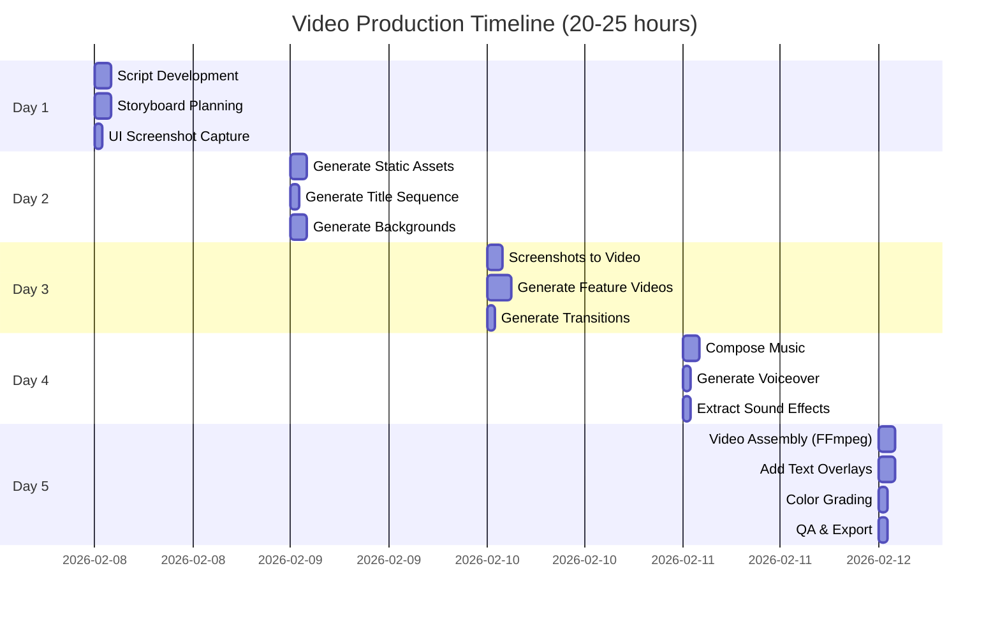

### Cost Estimation

| Service | Usage | Estimated Cost |
|---------|-------|----------------|
| **Veo 3.1** | 10-15 video generations (8-15 sec each) | $50-75 |
| **Veo 3.1 Fast** | 20-30 shorter clips (3-6 sec each) | $30-45 |
| **Imagen 3** | 15-20 high-quality images | $15-20 |
| **Lyria RealTime** | 3 minutes of music | $5-10 |
| **Gemini TTS** | 500-800 words narration | $2-5 |
| **Gemini 3 Pro** | Script generation | $3-5 |
| **TOTAL** | | **$105-160** |

**Cost Optimization**:
- Use Veo 3.1 Fast for backgrounds (saves ~40%)
- Generate at 720p to preview, then 1080p for finals
- Reuse backgrounds with different overlays
- Batch similar generations together

### Assets Checklist

**Generate with AI**:
- [ ] Title sequence (Veo 3.1)
- [ ] Background videos for each section (Veo 3.1)
- [ ] FCP logo and branding (Imagen 3)
- [ ] Architecture diagram (Imagen 3)
- [ ] Feature icons (Imagen 3)
- [ ] UI interaction animations (Veo Image-to-Video)
- [ ] Background music (Lyria)
- [ ] Voiceover narration (Gemini TTS)

**Prepare Manually**:
- [ ] UI screenshots of each feature
- [ ] Final script with timings
- [ ] FFmpeg assembly timeline
- [ ] Text overlay specifications

### Alternative: Hybrid Approach

If full AI generation is too ambitious:

1. **Manual Recording**: Record screen demos yourself
2. **AI Polish**: Use Veo to add transitions, effects
3. **AI Audio**: Use Lyria + TTS for soundtrack
4. **AI Graphics**: Use Imagen for logos, titles, overlays

This reduces costs by ~60% while still showcasing Gemini 3.

---

## 🔧 TROUBLESHOOTING GUIDE

### Common Issues & Solutions

#### Issue: Veo API Rate Limits

**Problem**: Getting rate limit errors when generating videos.

**Solution**:
```python
import time
from tenacity import retry, stop_after_attempt, wait_exponential

@retry(stop=stop_after_attempt(3), wait=wait_exponential(multiplier=1, min=4, max=60))
def generate_with_retry(model, prompt, **kwargs):
    """
    Retry video generation with exponential backoff
    """
    try:
        return genai.generate_video(model=model, prompt=prompt, **kwargs)
    except Exception as e:
        if "rate_limit" in str(e).lower():
            print(f"Rate limited, waiting before retry...")
            time.sleep(30)
            raise  # Trigger retry
        else:
            raise  # Don't retry other errors

# Use it
video = generate_with_retry(
    model="veo-3.1",
    prompt="...",
    duration=10
)
```

**Prevention**:
- Add 10-15 second delays between Veo requests
- Use Veo 3.1 Fast for non-critical clips (faster queue)
- Generate at 720p first to preview, then 1080p for finals
- Batch generate overnight when possible

---

#### Issue: Veo Generated Video Doesn't Match Prompt

**Problem**: Generated video looks wrong or misses key elements.

**Solutions**:

1. **Be More Specific in Prompts**:
```python
# ❌ Too vague
"A kitchen scene with food"

# ✅ Detailed and specific
"""
Modern home kitchen, minimalist white countertops, natural daylight from
left window. Colorful fresh vegetables (red tomatoes, green lettuce, orange
carrots) arranged on wooden cutting board. iPhone 14 Pro in foreground,
screen facing up. Camera: slow horizontal dolly right, starting wide,
ending on phone close-up. Shallow depth of field (f/2.8), background
softly blurred. Duration: 10 seconds, 1080p, 16:9.
"""
```

2. **Use Reference Images**:
```python
# Provide reference for specific style
reference_image = "reference_kitchen_aesthetic.jpg"
video = genai.generate_video(
    model="veo-3.1",
    prompt="...",
    reference_image=reference_image  # Guides style/mood
)
```

3. **Iterate with Fast Model First**:
```python
# Test with Veo Fast (cheaper, faster)
test_video = genai.generate_video(
    model="veo-3.1-fast",
    prompt=my_prompt,
    duration=5,
    resolution="720p"
)

# Review, refine prompt, then generate final with full Veo
if test_video_looks_good:
    final_video = genai.generate_video(
        model="veo-3.1",
        prompt=refined_prompt,
        duration=10,
        resolution="1080p"
    )
```

---

#### Issue: Audio/Video Sync Problems in FFmpeg

**Problem**: Voiceover doesn't align with video, or audio cuts off early.

**Solution**:
```python
# Calculate exact audio positioning
def calculate_audio_delays(timeline):
    """
    Returns delay values for each audio segment
    """
    delays = []

    for segment in timeline:
        video_start = segment["start_time"]
        audio_start = segment["audio_start"]  # When audio should play
        delay = audio_start - video_start

        delays.append({
            "audio_file": segment["audio_file"],
            "delay": max(0, delay)  # No negative delays
        })

    return delays

# Apply delays in FFmpeg
audio_streams = []
for i, delay_info in enumerate(delays):
    audio = ffmpeg.input(delay_info["audio_file"])

    if delay_info["delay"] > 0:
        # Add silence padding
        audio = audio.filter('adelay', f"{int(delay_info['delay'] * 1000)}|{int(delay_info['delay'] * 1000)}")

    audio_streams.append(audio)

# Mix all audio streams
mixed_audio = ffmpeg.filter(audio_streams, 'amix', inputs=len(audio_streams))
```

---

#### Issue: Text Overlays Not Appearing

**Problem**: FFmpeg drawtext filter silently fails or text doesn't show.

**Debugging**:
```python
# Test text overlay on static image first
test_stream = ffmpeg.input("test_frame.png")

test_stream = test_stream.drawtext(
    text="TEST TEXT",
    fontfile="/System/Library/Fonts/Supplemental/Arial.ttf",  # Use absolute path
    fontsize=72,
    fontcolor="white",
    x="(w-text_w)/2",
    y="(h-text_h)/2",
    box=1,  # Add background box for debugging
    boxcolor="black@0.5"
)

ffmpeg.output(test_stream, "test_output.png").run()

# If this works, issue is with timing/enable filter
```

**Common Fixes**:
1. Use absolute font paths
2. Escape special characters in text: `text.replace("'", "\\'")`
3. Check `enable` timing: `enable="between(t,2,5)"` (2s to 5s)
4. Verify font file exists: `Path(fontfile).exists()`

---

#### Issue: Imagen Generates Wrong Style

**Problem**: Generated logos/icons don't match desired aesthetic.

**Solution - Style References**:
```python
# Add explicit style references in prompt
imagen_prompt = """
[Main design description]

Style reference: Like Stripe's logo (modern, minimal, tech brand)
Similar to: Vercel, Linear, GitHub logos
Aesthetic: Silicon Valley startup, clean lines, geometric
NOT like: Vintage, ornate, hand-drawn, corporate 90s

Technical specs:
- Vector-style (clean edges, scalable)
- Flat design (no gradients except where specified)
- Ample negative space
- High contrast
"""

image = genai.generate_image(
    model="imagen-3",
    prompt=imagen_prompt,
    aspect_ratio="1:1",
    quality="high",
    negative_prompt="blurry, low quality, pixelated, jpeg artifacts"  # What to avoid
)
```

---

#### Issue: Video File Size Too Large

**Problem**: Final video exceeds 500 MB, upload is slow.

**Solution - Optimize Encoding**:
```python
# Two-pass encoding for better compression
def optimize_video_size(input_video, output_video, target_bitrate="4M"):
    """
    Two-pass encoding for optimal quality/size ratio
    """

    # Pass 1: Analysis
    pass1 = ffmpeg.input(input_video).output(
        "/dev/null" if os.name != "nt" else "NUL",
        vcodec='libx264',
        video_bitrate=target_bitrate,
        preset='slow',
        **{'pass': 1, 'f': 'null'}
    )
    pass1.run()

    # Pass 2: Encode
    pass2 = ffmpeg.input(input_video).output(
        output_video,
        vcodec='libx264',
        video_bitrate=target_bitrate,
        acodec='aac',
        audio_bitrate='128k',  # Lower audio bitrate
        preset='slow',
        pix_fmt='yuv420p',
        **{'pass': 2}
    )
    pass2.run()

    print(f"Optimized video size: {Path(output_video).stat().st_size / 1024 / 1024:.1f} MB")

# Usage
optimize_video_size("fcp_demo_FINAL.mp4", "fcp_demo_optimized.mp4", target_bitrate="4M")
```

**Alternative**: Use CRF (Constant Rate Factor) for size control:
```python
# CRF 23 = good quality, reasonable size
# CRF 18 = excellent quality, larger
# CRF 28 = lower quality, smaller
stream = ffmpeg.input(input_video)
stream = ffmpeg.output(stream, output_video,
                      vcodec='libx264',
                      crf=23,
                      preset='slow')
stream.run()
```

---

#### Issue: Lyria Music Doesn't Match Video Mood

**Problem**: Generated music doesn't fit the scene transitions.

**Solution - Regenerate Specific Sections**:
```python
# Instead of one long track, generate shorter sections independently
# Then concatenate with crossfades

sections = {
    "intro": music.generate_realtime(
        style="ambient",
        density="sparse",
        tempo=90,
        duration=30
    ),
    "demo": music.generate_realtime(
        style="electronic_upbeat",
        density="medium",
        tempo=110,
        duration=120
    ),
    "outro": music.generate_realtime(
        style="triumphant",
        density="rich",
        tempo=120,
        duration=30
    )
}

# Crossfade sections in FFmpeg
intro = ffmpeg.input("intro.mp3")
demo = ffmpeg.input("demo.mp3")
outro = ffmpeg.input("outro.mp3")

# Apply crossfades
intro_demo = ffmpeg.filter([intro, demo], 'acrossfade', d=2)  # 2 sec fade
demo_outro = ffmpeg.filter([intro_demo, outro], 'acrossfade', d=2)

ffmpeg.output(demo_outro, "background_music_final.mp3").run()
```

---

### Performance Optimization Tips

#### Parallel Generation

Generate independent assets concurrently to save time:

```python
from concurrent.futures import ThreadPoolExecutor
import time

def generate_asset(config):
    """
    Generate a single asset (video or image)
    """
    asset_type = config["type"]
    name = config["name"]

    try:
        if asset_type == "video":
            result = genai.generate_video(
                model=config["model"],
                prompt=config["prompt"],
                duration=config["duration"]
            )
        elif asset_type == "image":
            result = genai.generate_image(
                model=config["model"],
                prompt=config["prompt"]
            )

        result.save(f"assets/{name}.{config['format']}")
        return f"✓ {name}"

    except Exception as e:
        return f"✗ {name}: {str(e)}"

# Define all assets
all_assets = [
    {"type": "image", "name": "fcp_logo", "model": "imagen-3", ...},
    {"type": "video", "name": "title_seq", "model": "veo-3.1", ...},
    # ... more assets
]

# Generate in parallel (respecting rate limits)
with ThreadPoolExecutor(max_workers=3) as executor:
    results = executor.map(generate_asset, all_assets)

for result in results:
    print(result)
```

#### Local Caching

Cache generated assets to avoid regeneration:

```python
import hashlib
import json
from pathlib import Path

def get_cache_key(prompt, **kwargs):
    """
    Create unique cache key from generation parameters
    """
    cache_data = {"prompt": prompt, **kwargs}
    cache_str = json.dumps(cache_data, sort_keys=True)
    return hashlib.md5(cache_str.encode()).hexdigest()

def generate_with_cache(generate_fn, cache_dir="cache", **kwargs):
    """
    Check cache before generating new asset
    """
    cache_path = Path(cache_dir)
    cache_path.mkdir(exist_ok=True)

    cache_key = get_cache_key(**kwargs)
    cache_file = cache_path / f"{cache_key}.mp4"

    if cache_file.exists():
        print(f"✓ Using cached asset: {cache_key}")
        return str(cache_file)

    # Generate new
    result = generate_fn(**kwargs)
    result.save(str(cache_file))
    print(f"✓ Generated and cached: {cache_key}")

    return str(cache_file)

# Usage
video_path = generate_with_cache(
    genai.generate_video,
    model="veo-3.1",
    prompt="...",
    duration=10
)
```

---

### Quality Checkpoints

Create validation checkpoints throughout production:

```python
def validate_asset(asset_path, expected_duration=None, expected_resolution=None):
    """
    Validate generated asset meets requirements
    """
    if not Path(asset_path).exists():
        return False, "File not found"

    probe = ffmpeg.probe(asset_path)

    # Check duration
    if expected_duration:
        actual_duration = float(probe['format']['duration'])
        if abs(actual_duration - expected_duration) > 1.0:  # 1 second tolerance
            return False, f"Duration mismatch: {actual_duration}s (expected {expected_duration}s)"

    # Check resolution
    if expected_resolution:
        video_stream = next(s for s in probe['streams'] if s['codec_type'] == 'video')
        actual_res = (int(video_stream['width']), int(video_stream['height']))
        if actual_res != expected_resolution:
            return False, f"Resolution mismatch: {actual_res} (expected {expected_resolution})"

    # Check for corruption
    try:
        # Try to read first and last frame
        ffmpeg.input(asset_path, ss=0).output('test_frame1.png', vframes=1).run(quiet=True)
        duration = float(probe['format']['duration'])
        ffmpeg.input(asset_path, ss=duration-1).output('test_frame2.png', vframes=1).run(quiet=True)
    except:
        return False, "Video appears corrupted"

    return True, "OK"

# Run validation after each generation
assets_to_validate = [
    ("assets/01_title_sequence.mp4", 8, (1920, 1080)),
    ("assets/02_problem_bg.mp4", 10, (1920, 1080)),
    # ...
]

print("\n🔍 Validating generated assets...")
all_valid = True
for asset_path, duration, resolution in assets_to_validate:
    valid, message = validate_asset(asset_path, duration, resolution)
    status = "✓" if valid else "✗"
    print(f"{status} {Path(asset_path).name}: {message}")
    all_valid = all_valid and valid

if all_valid:
    print("\n✅ All assets validated successfully!")
else:
    print("\n⚠️  Some assets failed validation. Review and regenerate.")
```

---

### Decision Tree: Which Approach to Use?

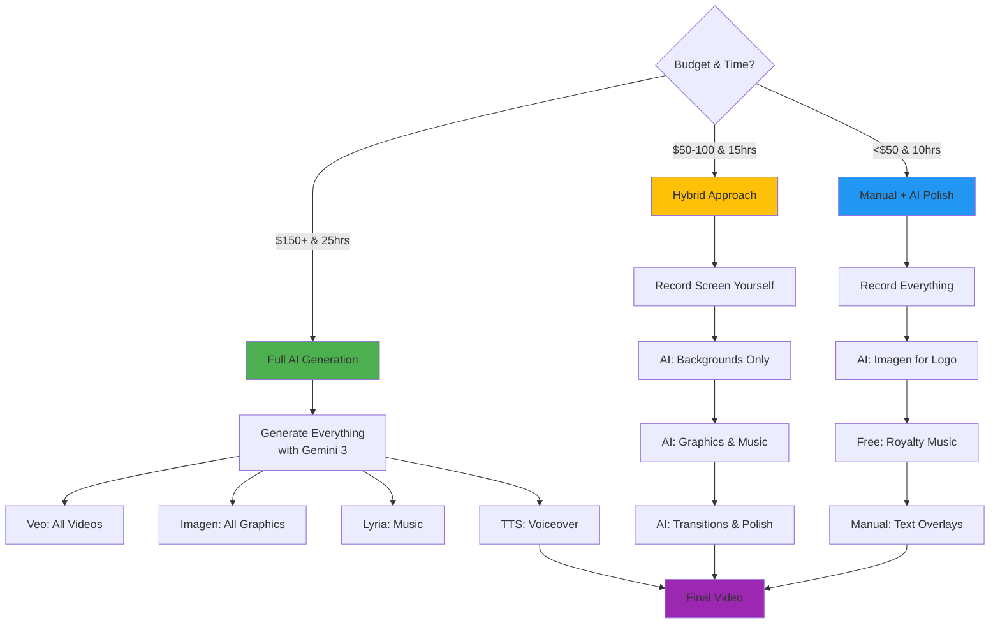

**Recommendation**: Start with Hybrid approach. You get:
- Cost savings (~60%)
- Time savings (~40%)
- Still showcase Gemini 3 capabilities
- More control over critical scenes

---

## 📚 Additional Resources

**Full Generation Guide**: `/Users/jwegis/Projects/fcp-protocol/video-script.md`

**Key Sections**:
- Phase 2: Asset Creation with Veo & Imagen
- Phase 4: Audio Production with Lyria & TTS
- Phase 6: Video Assembly with FFmpeg
- Complete Python Automation Script

**Gemini 3 API Docs**:
- [Veo 3.1 Video Generation](https://ai.google.dev/gemini-api/docs/video)
- [Imagen 3 Image Generation](https://ai.google.dev/gemini-api/docs/imagen)
- [Lyria Music Generation](https://ai.google.dev/gemini-api/docs/music-generation)
- [Gemini TTS](https://ai.google.dev/gemini-api/docs/speech-generation)

---

End of Storyboard. Ready for AI-powered production! 🎬🤖
